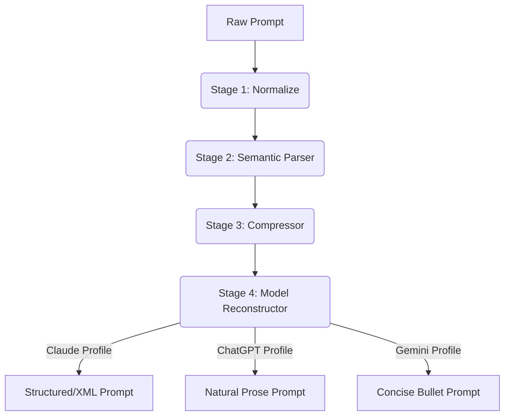

# ⚡ Prompt Optimizer (PromptForge)

> A production-grade, model-aware prompt compression and optimization library for ChatGPT, Claude, and Gemini.

[](https://badge.fury.io/py/promptforge)
[](https://opensource.org/licenses/MIT)
[](https://www.python.org/downloads/)

LLM sessions are token-bounded. Every wasted token costs money (API limits) or context capacity (consumer web interfaces). Current "prompt compressors" are often just glorified regex cleaners—they strip filler words but destroy the grammar, structure, and implicit intent of your prompts.

**Prompt Optimizer (PromptForge)** is a *semantic reduction pipeline*. It doesn't just delete words; it:
1. **Preserves** the core task, constraints, output format, and your original intent.
2. **Restructures** long, conversational prose into structurally optimized, token-efficient formats.
3. **Adapts** to the target AI model you are using. (For instance, Claude needs explicit XML tags; ChatGPT tolerates conversational prose; Gemini prefers dense bullets).

---

## 🚀 Key Features

*   **Model-Aware Profiles**: The pipeline physically changes how your prompt is rebuilt based on the AI answering it (ChatGPT, Claude, or Gemini).
*   **4-Stage Pure-Compute Pipeline**: No API keys are required to optimize prompts.
    1.  `Normalize`: Safely remove filler strings without destroying punctuation boundaries.
    2.  `Parse`: Dynamically extract semantic intent (task, constraints, context, format).
    3.  `Compress`: Condense verbose phrases ("due to the fact that" -> "because"), deduplicate rules.
    4.  `Reconstruct`: Rebuild in the target LLM's mathematically optimal structural format.
*   **Accurate Token Metrics**: Real-time savings estimation using `tiktoken` (for exact OpenAI bounds) and heuristic estimators (for Claude/Gemini approximation).
*   **Premium Web UI**: A stunning, zero-dependency, local web application to visualize prompt savings in real-time.
*   **Robust CLI Tool**: Batch process text files or compare optimization results across all 3 models from your terminal.

---

## 📥 Installation

Prompt Optimizer is packaged under the name `promptforge` on PyPI.

```bash
# Basic installation
pip install promptforge

# Installation with precise ChatGPT token counting support
pip install promptforge[openai]
```

---

## 🛠️ How to Use Prompt Optimizer

There are four ways you can use Prompt Optimizer, depending on your workflow.

### 1. The Visual Web UI (Easiest)
If you prefer a side-by-side visual editor where you can paste prompts and drag a slider to dictate how aggressive the AI compression is, launch the builtin Web UI:

```bash
python -m promptforge.serve --port 3000
```
Browse to `http://localhost:3000`. You can paste your text safely. No API keys are required, and all processing is local.

### 2. The CLI (For quick terminal usage)
You can optimize text files directly from your terminal.

**Optimize a prompt explicitly for Claude:**
```bash
promptforge optimize draft.txt --model claude > optimized.txt
```

**Compare a prompt across all 3 models to see which saves the most tokens:**
```bash
promptforge compare draft.txt
```

### 3. Python API (For Developers)
If you are building an agentic AI system or RAG pipeline, you can import and use Prompt Optimizer in your code to save tokens dynamically.

```python
from promptforge import optimize

# Read your long, verbose prompt
raw_prompt = """
Hey Claude, could you please basically just write a Python function that calculates 
Fibonacci numbers? Make sure to use recursion and ensure the code is efficient. 
Return the result as a list. Thanks!
"""

# Run optimization pipeline tailored for Claude
result = optimize(raw_prompt, model="claude", aggressiveness="moderate")

print(result.optimized)
# Prints:
# <task>write a Python function that calculates Fibonacci numbers.</task>
# 
# <constraints>
#   - use recursion
#   - code is efficient
# </constraints>
# 
# <output_format>Return the result as a list.</output_format>

print(f"Tokens Saved: {result.savings_percent:.1f}%")
```

### 4. Direct Custom Instructions (No Code Required)
Don't want to install Python or run any code? We have crafted specific **Semantic Prompt Optimizer Markdown rules** that you can copy and paste directly into ChatGPT, Claude, or Gemini system instructions. Once pasted, the AI will act like the Prompt Optimizer and rewrite your prompts for you!

Check out the markdown files in the `docs/` folder:
- 🤖 [ChatGPT Prompt Rules](docs/chatgpt-optimizer.md) (Paste into ChatGPT's Custom Instructions)
- 🧠 [Claude Prompt Rules](docs/claude-optimizer.md) (Paste into Claude's Project System Prompt)
- ✨ [Gemini Prompt Rules](docs/gemini-optimizer.md) (Paste into Gemini's Advanced System Instructions)

---

## 🏗️ Technical Architecture

Prompt Optimizer parses your text using robust heuristics to prevent data loss.



## 🔐 Security & Privacy
Prompt Optimizer is built for Application Security constraints.
1. The heuristic pipeline requires **ZERO** API calls. Your prompt data never leaves your machine.
2. We utilize `html.escape()` and strict length bounds (`MAX_INPUT_LENGTH=500_000`) to completely neuter prompt injection attacks and XSS vectors within the Web UI environment.

## 📜 License

MIT License. See `LICENSE` for details.
